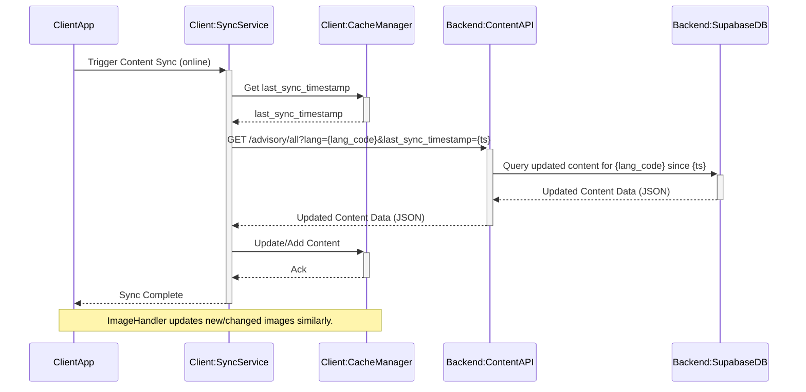

# High-Level Architecture: Agricultural Advisory Services (Crop & Post-Harvest)

**Version:** 1.0
**Date:** 2025-05-12
**Module Name:** Agricultural Advisory Services (Crop & Post-Harvest)

## 1. Overview

This document outlines the high-level architecture for the Agricultural Advisory Services module within the AgriConnect application. This module aims to provide farmers with accessible crop and post-harvest advisory content, with strong emphasis on offline access, multi-language support, and a simple user interface, as detailed in the PRD ([`docs/PRD.md`](docs/PRD.md)) and feature specification ([`docs/specs/Agricultural_Advisory_Services_Crop_Post-Harvest_overview.md`](docs/specs/Agricultural_Advisory_Services_Crop_Post-Harvest_overview.md)).

The architecture follows a client-server model, where the mobile client consumes content from a Supabase backend, heavily utilizing local caching for offline functionality and performance.

## 2. Architectural Drivers

The design is primarily driven by the following key requirements:
*   **Offline Content Access:** Content must be available without an internet connection.
*   **Multi-language Support:** Advisory content needs to be available in multiple local languages.
*   **Content Synchronization:** Efficient updates of cached content when online.
*   **Simple UI for Readability:** Easy navigation and consumption of information for users with varying digital literacy.
*   **Scalable Content Management (Consumption Side):** The application consumes content managed externally.

## 3. Key Components

The architecture comprises components on the client-side, backend, and acknowledges external dependencies.

### 3.1. Client-Side Components (Mobile Application)

*   **Advisory UI Module:**
    *   Responsibilities: Renders categorized advisory content (crop and post-harvest), handles user navigation, ensures a simple and accessible UI.
    *   Interactions: Retrieves data from the Content Cache Manager, responds to user input.
*   **Content Cache Manager:**
    *   Responsibilities: Manages local storage (e.g., SQLite or structured JSON files) of advisory text and image metadata. Provides cached content to the UI, especially during offline mode.
    *   Interactions: Receives data from Synchronization Service, provides data to Advisory UI Module and Image Handling Service.
*   **Synchronization Service:**
    *   Responsibilities: Fetches new/updated content from the backend API when online. Implements delta updates (e.g., using `last_sync_timestamp` or content versioning). Updates the local cache.
    *   Interactions: Communicates with the Backend Content API, updates the Content Cache Manager.
*   **Localization Manager:**
    *   Responsibilities: Manages content display based on the app's global language setting. Ensures correct language versions are requested and rendered.
    *   Interactions: Influences API requests made by Synchronization Service, provides localized UI strings.
*   **Image Handling Service:**
    *   Responsibilities: Downloads, caches, and displays images associated with advisory content. Optimizes images for mobile and offline viewing.
    *   Interactions: Retrieves image URLs from Content Cache Manager, fetches images from CDN/backend, provides images to Advisory UI Module.

### 3.2. Backend Components (Supabase & API)

*   **Supabase Database (PostgreSQL):**
    *   Responsibilities: Master store for all advisory content, including different language versions, text, image URLs, categories, metadata (versions, timestamps).
    *   Technology: PostgreSQL hosted on Supabase.
*   **Content API (Conceptual - e.g., Supabase Functions):**
    *   Responsibilities: Provides endpoints (e.g., `GET /api/v1/advisory/all`) for clients to fetch/sync content. Supports parameters for language and incremental updates (`last_sync_timestamp`).
    *   Interactions: Queries Supabase DB, returns structured JSON to client's Synchronization Service.
*   **Content Delivery Network (CDN):**
    *   Responsibilities: Serves image assets efficiently.
    *   Technology: Integrated with Supabase Storage or a separate CDN.

### 3.3. External Components

*   **Content Management System (CMS):**
    *   Responsibilities: External system/process for creating, curating, versioning, and translating advisory content by agricultural experts. Populates the Supabase database.
    *   Note: This is a critical dependency but out of scope for the app's internal architecture.

## 4. Data Flow Diagrams (Conceptual)

### 4.1. Initial Content Fetch & Caching
```mermaid
sequenceDiagram
    participant ClientApp
    participant SyncService as Client:SyncService
    participant CacheManager as Client:CacheManager
    participant ImageHandler as Client:ImageHandler
    participant BackendAPI as Backend:ContentAPI
    participant SupabaseDB as Backend:SupabaseDB
    participant CDN

    ClientApp->>+SyncService: Request Advisory Content (first time/cache empty)
    SyncService->>+BackendAPI: GET /advisory/all?lang={lang_code}
    BackendAPI->>+SupabaseDB: Query content for {lang_code}
    SupabaseDB-->>-BackendAPI: Content Data (JSON)
    BackendAPI-->>-SyncService: Content Data (JSON)
    SyncService->>+CacheManager: Store Content (text, image_urls)
    CacheManager-->>-SyncService: Ack
    loop For each image_url
        SyncService->>+ImageHandler: Download/Cache Image(image_url)
        ImageHandler->>+CDN: GET image
        CDN-->>-ImageHandler: Image data
        ImageHandler->>CacheManager: Store Image
        CacheManager-->>-ImageHandler: Ack
    end
    ImageHandler-->>-SyncService: Ack
    SyncService-->>-ClientApp: Content Ready (from cache)
```

### 4.2. Content Synchronization (Updates)


### 4.3. Offline Access
```mermaid
sequenceDiagram
    participant User
    participant AdvisoryUI as Client:AdvisoryUI
    participant CacheManager as Client:CacheManager
    participant ImageHandler as Client:ImageHandler

    User->>+AdvisoryUI: Navigates to Advisory Section (Offline)
    AdvisoryUI->>+CacheManager: Request Content
    CacheManager-->>-AdvisoryUI: Cached Text Content
    AdvisoryUI->>+ImageHandler: Request Images for Content
    ImageHandler->>CacheManager: Request Cached Images
    CacheManager-->>-ImageHandler: Cached Image Data
    ImageHandler-->>-AdvisoryUI: Displayable Images
    AdvisoryUI-->>-User: Displays Content
```

## 5. Data Models (Conceptual)

The primary data will be stored in Supabase and cached on the client. The API will deliver language-specific content.

### 5.1. Supabase (PostgreSQL) - Example Structure
A preferred model involves a main content table and a localization table:

*   **`AdvisoryItem` Table (Core Content):**
    *   `guid` (TEXT, PK - Globally Unique ID, e.g., `crop_tomato_pest_aphids`)
    *   `type` (TEXT - Enum: "crop_advisory", "post_harvest")
    *   `image_url` (TEXT - URL to image on CDN, common for all languages)
    *   `version` (INTEGER or TIMESTAMP - For tracking updates)
    *   `last_updated` (TIMESTAMP WITH TIME ZONE)
    *   `tags` (TEXT[] - Array of tags for filtering/search, optional)
    *   `default_reference_name` (TEXT - Internal non-localized name for easier management)

*   **`AdvisoryItem_L10n` Table (Localized Content):**
    *   `item_guid` (TEXT, FK to `AdvisoryItem.guid`)
    *   `language_code` (TEXT - e.g., "en", "hi", "mr")
    *   `title` (TEXT - Localized)
    *   `summary` (TEXT - Localized)
    *   `details_text` (TEXT - Localized, can be Markdown)
    *   `crop_name` (TEXT - Localized, nullable)
    *   `category` (TEXT - Localized)
    *   PRIMARY KEY (`item_guid`, `language_code`)

The API ([`docs/specs/Agricultural_Advisory_Services_Crop_Post-Harvest_overview.md:132`](docs/specs/Agricultural_Advisory_Services_Crop_Post-Harvest_overview.md:132)) would then join these and return a denormalized list for the requested language, similar to the example JSON structure in the feature specification.

### 5.2. Client-Side Cache

*   **Structure:** Likely a direct representation of the JSON received from the API, possibly stored as structured files (e.g., JSON per language) or in a local SQLite database.
*   **Metadata:** `last_sync_timestamp` stored per language to facilitate delta updates.
*   **Images:** Cached in the device's file system, managed by the Image Handling Service.

## 6. Technology Choices

*   **Backend Database:** Supabase (PostgreSQL) - Mandated by PRD.
*   **API Implementation:** Supabase Functions (e.g., Edge Functions) are recommended.
*   **Client-Side Caching (Data):** SQLite for structured storage or direct JSON file storage.
*   **Client-Side Caching (Images):** Platform-specific image caching libraries (e.g., Glide for Android) or cross-platform solutions.
*   **Content Delivery Network (CDN):** For images (e.g., Supabase Storage CDN).

## 7. Key Architectural Decisions & Rationale

*   **Offline-First Content Delivery:** Local cache is the primary source for UI.
    *   *Rationale:* Ensures app usability in low/no connectivity areas (PRD line 35, 41).
*   **Delta Synchronization via API:** Only new/updated content is fetched.
    *   *Rationale:* Minimizes data usage and sync time (critical for target users).
*   **Language-Specific Content Fetching:** API parameter `?lang={language_code}`.
    *   *Rationale:* Efficiently supports multi-language requirements and reduces unnecessary data download (PRD line 46, 58).
*   **Decoupled Content Management:** App consumes content; creation/translation is external.
    *   *Rationale:* Simplifies app architecture; aligns with spec (Spec D3, NFR6).
*   **Normalized Backend, Denormalized API Response:** Backend stores translations efficiently; API provides easy-to-consume data for the client.
    *   *Rationale:* Balances backend data integrity with client-side simplicity.

## 8. Dependencies and Constraints

*   **External CMS:** High dependency on the quality, accuracy, and timeliness of content from an external CMS (Spec D3).
*   **Global Language Selection System:** Relies on an app-wide language setting (Spec D2).
*   **Network Connectivity:** Required for initial fetch and updates.
*   **Device Storage:** Caching (especially images) needs careful management on low-end devices. Caching only the current active language's content is recommended.
*   **Supabase Capabilities & Limits:** API logic and data volume must align with Supabase platform constraints.

## 9. Potential Risks and Mitigations

*   **Synchronization Complexity:**
    *   *Risk:* Errors in delta sync logic leading to inconsistent data.
    *   *Mitigation:* Robust content versioning (timestamps, explicit versions), thorough testing.
*   **Cache Management:**
    *   *Risk:* Excessive storage use, cache corruption.
    *   *Mitigation:* Cache only current language, clear cache invalidation policies, image optimization.
*   **Performance on Low-End Devices:**
    *   *Risk:* Slow UI rendering with large content lists/images.
    *   *Mitigation:* UI virtualization, image optimization, background data processing.
*   **Content Quality from External CMS:**
    *   *Risk:* Feature value diminished by poor external content.
    *   *Mitigation:* Clear data format/API contract with CMS, client-side validation/error handling for content.

## 10. Scalability Considerations

*   **Content Volume:** The Supabase database and API design should handle a growing library of advisory content and languages. Proper indexing in Supabase is crucial.
*   **User Load:** API endpoints (Supabase Functions) should be scalable. CDN for images helps offload traffic.
*   **Image Assets:** CDN usage is critical for scaling image delivery.

This architecture provides a foundation for delivering reliable, accessible, and localized agricultural advisory services to farmers.